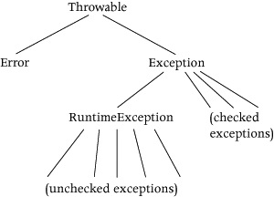

# Exceptions

## Intro

Un'astrazione procedurale è una mappatura da argomenti a risultati, con una possibile modifica degli argomenti. Gli argomenti fanno parte del **dominio** della procedura e i risultati sono membri del suo **range**

A volte una procedura ha senso solo per argomenti di un sottoinsieme del suo dominio. Ad esempio una procedura che computa un fattoriale ha senso solo se il suo argomento è un numero positivo. Un altro esempio è la procedura *search*, che ritorna l'indice di un elemento solo se compare nell'array. Un modo di gestire queste situazioni è usare le procedure parziali. Ad esempio potremmo definire *gcd* solo quando i suoi argomenti sono positivi:

    public static int gcd (int n, int d)
    // REQUIRES: n, d > 0
    // EFFECTS: Returns the greatest common divisor of n and d.

Tuttavia le procedure parziali sono generalmente una cattiva idea perchè non c'è nessuna garanzia che gli argomenti passati alla procedura siano nel formato permesso. Quando la procedura quindi viene chiamata con un formato diverso da quello consentito potrebbe entrare in loop o ritornare un errore, e questo potrebbe causare problemi, ad esempio usando risultati errati in procedure successive. Le procedure parziali portano a programmi non robusti.

Un **Programma robusto** è un programma che continua a comportarsi ragionevolmente anche in presenza di errori. Se avviene un errrore il programma potrebbe non essere in grado di provvedere esattamente lo stesso comportamento come se non ci fossero errori, ma si dovrebbe comportare in maniera ben definita. In generale dovrebbe continuare dopo l'errore provvedendo un'approssimazione del suo comportamento in assenza di esso. Un metodo per aumentare la robustezza è l'uso delle procedure totali: procedure il cui comportamento è definito per tutti gli argomenti del dominio.

Come può essere avvisato l'utente se un problema insorge? Una possibilità è di usare un risultato particolare per esprimere l'informazione, ad esempio ritornare 0 se l'argomento non è positivo

    public static int fact (int n)
    // EFFECTS: If n > 0 returns n! else returns 0.

Questa soluzione tuttavia non è molto soddisfacente, in quanto una chiamata di quel valore è probabilmente un errore, è meglio trattarlo come caso speciale, così da renderlo più evidente. Inoltre è inefficiente perchè la funzione dopo aver ottenuto il risultato dovrebbe anche controllarlo verificando che non sia il caso speciale. Oltretutto se ogni valore del tipo di ritorno è possibile, la soluzione di riportare un risultato speciale è impossibile (es. se il risultato potrebbe essere un qualsiasi *int*, non è possibile scegliere un valore specifico a cui assegnare l'errore.)

Necessitiamo quindi di un approccio che raccolga informazioni sulle situazioni insolite in tutti i casi, anche quando tutti i valori del tipo di ritorno sono risultati possiile. Inoltre sarebbe desiderabile per l'approccio di saper distinguere queste situazioni in qualche modo, così che non possano essere ignorate per sbaglio. Sarebbe inoltre apprezzabile che la gestione di queste situazioni sia separata dal normale flusso del programma.

Per fare ciò possiamo utilizzare le **eccezioni**. Esse permettono a una procedura di terminare *normalmente*, ritornando un risultato, o *eccezionalmente*

## Specifiche
Una procedura che può terminare eccezionalmente è indicata avendo una clausola `throws` nella sua intestazione, es. :

    public static int fact (int n) throws NonPositiveException

afferma che `fact` può terminare lanciando un eccezione, in questo caso di tipo `NonPositiveException`. Una procedura può lanciare più di un tipo di eccezione

    throws NullPointerException, NotFoundException

Le specifiche di una procedura che lancia eccezioni devono rendere chiaro cosa sta succedendo: nell'intestazione devono essere presenti *tutte* le eccezioni che possono essere lanciate come parte del comportamento ordinario, ad esempio per tutti gli inputs che rispettano la `REQUIRES`. Successivamente, `EFFECTS` deve chiaramente definire il comportamento che per tutti gli input non gestiti dalla `REQUIRES`. Dato che in questo comportamento sono incluse le eccezioni, `EFFECTS` deve definire cosa causa alla procedura terminare con ogni eccezione, e il suo comportamento in ogni caso. Se una eccezione viene lanciata per un dato set di valori, esso *non deve essere incluso* nella `REQUIRES`. Terminare con un eccezione è quindi parte del normale comportamento della procedura.

Come sempre la `EFFECTS` assume che le condizioni della `REQUIRES` siano rispettate. Quando sono presenti dei side effects, bisogna descrivere chiaramente come esse interagiranno con le eccezioni. `MODIFIES` indica che un argomento sarà modificato ma non specifica quando. Se ci sono eccezioni è probabile che la modifica avverà solo per alcuni di essi. Nella `EFFECTS` bisogna descrivere chiaramente cosa succederà ad ogni modifica, es:

    public static void addMax (Vector v, Integer x)
        throws NullPointerException, NotSmallException
    // REQUIRES: All elements of v are Integers.
    // MODIFIES: v
    // EFFECTS: If v is null throws NullPointerException; if v contains an element larger than x throws NotSmallException; else adds x to v.

indica che `v` è modificata solo quando `addMax` ritorna normalmente.

## Meccanismo di funzionamento

I tipi di eccezioni sono sottotipi di `Exception` o di `RuntimeException`, ed essi sono a loro volta sottotipi di `Throwable`. Esistono due tipi di eccezioni

* **Checked**, sottotipo di `Exception`
* **Unchecked**, sottotipo di `RuntimeException`

    

La maggior parte delle eccezioni in Java sono tipo Unchecked (es. `Null-PointerException`, `IndexOutOfBoundException`). Ci sono due differenze sul come i due tipi di eccezioni possono essere usati in java:

*  1. Se una procedura può lanciare una eccezione Checked, Java richiede che la procedura sia descritta nelle specifiche della procedura, altrimenti ci sarà un errore di compile-time. Le procedure Unchecked non devono essere elencate nelle specifiche
* 2. Se il codice chiama una procedura che potrebbe lanciare un eccezione Checked, java richiede che esse siano gestite correttamente, altrimenti ci sarà un errore di compile-time. Le procedure Unchecked non devono essere gestite nel codice chiamante

Date queste differenze occorre pensare chiaramente quando definisco una nuova eccezione se essa dovrà essere Checked o Unchecked. Tuttavia è meglio deviare dalle regole di Java in una maniera importante: conviene elencare nelle specifiche TUTTE le eccezioni che vengono lanciate, sia Checked che Uncecked. Il motivo è che dal punto di vista di chi sta usando la procedura tutte le eccezioni sono importanti, non puoi capire come usare una procedura senza queste informazioni: è più diretto e immediato dichiararle nell'argomentazione piuttosto che nelle `EFFECTS`

## Definire le eccezioni

Quando una nuova eccezione è definita, nella sua dichiarazione è implicito se essa sia Checked o Unchecked: se il supertipo è `Exception` è Checked, se è `RuntimeException` è Unchecked.

    public class NewKindOfException extends Exception {
        public NewKindOfException( ) { super( ); }
        public NewKindOfException(String s) { super(s); }
    }

In questo caso con `extends Exception` fa intendere che `NewKindOfException` sia checked, altrimenti sarebbe stato `extends RuntimeException`

Il tipo eccezione provvede due costruttori. Il secondo costruttore inizializza l'eccezione per contenere una stringa contenuta come suo argomento che spieghi perchè l'eccezione è stata lanciata, es:

    Exception e1 = new NewKindOfException("this is the reason");

Fa in modo che l'oggetto `e1` contenga la stringa "this is the reason". Il primo costruttore invece inizializza l'oggetto per contenere la stringa vuota ad esempio

    Exception e2 = new NewKindOfException( );

La stringa e il tipo dell'eccezione possono essere ottenuti chiamando il metodo `toString` sull'oggetto dell'eccezione, ad esempio:

    String s = e1.toString( );

Immette dentro `s`

    ”NewKindOfException: this is the reason”

I tipi di eccezioni devono essre definiti in qualche pacchetto. Una possibilità è di definirle nello stesso pacchetto che contiene la classe del metodo che le ha lanciate. Un'alternativa migliore tuttavia è di avere un pacchetto che definisca i tipi di eccezioni. Questo permette alla stessa eccezione di essere usata in più sessioni. Java non richiede che i tipi di eccezioni abbiano il formato `EnameException`. Tuttavia è buona pratica di programmazione seguire questa convenzione per distinguere i tipi delle eccezioni dai tipi normali.

## Lanciare le eccezioni

Una procedura in Java può terminare lanciando un eccezione. Lo può fare usando l'affermazione `throw`, ad esempio:

    if (n <= 0) throw new NonPositiveException(”Num.fact”);

In questo caso sta venendo lanciato un oggetto del tipo `NonPositiveException`. In questo caso stiamo creando l'oggetto mentre lo lanciamo utilizzando `new`. Il problema principale quando lanciamo un'eccezione è cosa scrivere nel messaggio della stringa. Una buona pratica è quella di identificare la procedura che ha lanciato l'eccezione, così da rendere più semplice identificare l'errore

## Gestire le eccezioni

Quando una procedura termina con un eccezione, l'esecuzione non continua direttamente dopo la chiamata, ma passa al codice che gestisce l'eccezione. Ad esempio

    try { x = Num.fact(y); }
        catch (NonPositiveException e) {
        // in here can use e
    }

`try` è usato per gestire `NonPositiveEcception`: se la chiamata di `fact` lancia `NonPositiveEcception`, viene eseguita la `catch`. L'oggetto dell'eccezione è assegnato ad `e` così che possa essere usato nella gestione dell'errore. In questo caso è presente una sola `catch`, tuttavia se ne possono attaccare multiple a un singolo `try` per gestire più eccezioni diverse. Se un'eccezione non viene presa da un `try` posizionato all'interno da uno dei suoi `catch`, potrebbe essere invece preso da uno dei `catch` del `try` esterno ad esso, ad esempio

    try { ...;
        try { x = Arrays.search(v, 7); }
        catch (NullPointerException e) {
            throw new NotFoundException( ); }
    } catch (NotFoundException b) { ... }

la `catch` del `try` esterno gestirà l'eccezione `NotFoundException` se viene lanciato dalla chiamata di Arrays.search o dalla `catch` di `NullPointerException`

La `catch` non deve identificare il tipo di un oggetto di un'eccezione. Per esempio

    try { x = Arrays.search(v, y); }
    catch (Exception e) { s.println(e); return; }

`catch` gestirà sia `NullPointerExceepion` che `NotFoundException`. In questo caso `s` è un `PrintWriter` e `println` usa il metodo `toString` di `e` per ottenere l'informazione da stampare.

Il secondo modo di gestire un'eccezione è propagarla. Questo avviene quando una procedura P segnala un'eccezione che non è gestita dalla `catch` di nessun `try` contenuto in P. In questo caso Java propaga l'eccezione al chiamante della procedura se
* il tipo dell'eccezione o un suo supertipo non sono elencati nell'intestazione di P
* l'eccezione è Unchecked

Altrimenti vi è un errore di compilazione. Una procedura dovrebbe solo lanciare eccezioni elencate nelle sue specifiche. Java tuttavia non rinforza questo requisito per i tipi Unchecked, quindi bisogna rinforzarlo manualmente redendo chiaro il fatto che ogni eccezione lanciata dal codice, che sia esplicita o per propagazione, sia elencata nell'intestazione della procedura che sta venendo implementata.

### Gesttire elle eccezioni Unchecked

Potenzialmente ogni chiamata potrebbe lanciare un'eccezione Unchecked, e questo rende molto difficile gestirle perchè bisogna capire dove vengono generate. Ad esempio in

    try { x = y[n]; i = Arrays.search(z, x); }
    catch (IndexOutOfBoundsException e) {
        // handle IndexOutOfBoundsException from the array access y[n]
    }
    // code here continues assuming problem has been fixed

`IndexOutOfBoundException`, che è un'eccezione Unchecked, potrebbe avvenire a causa di un'errore nell'implementazione di search. L'unico modo per essere sicuri sull'origine di un'eccezione Unchecked è diminuire il raggio del try, per esempio

    try { x = y[n]; }
    catch (IndexOutOfBoundsException e) {
        // handle IndexOutOfBoundsException from the array access y[n]
    }
    i = Arrays.search(z, x);

in questo caso l'errore sarà sicuramente dall'accesso dell'array.